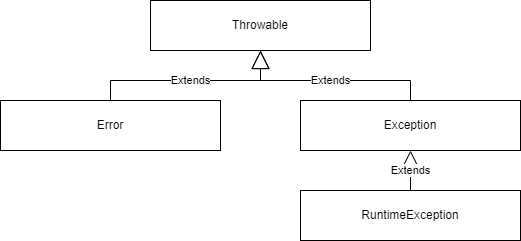

# 例外



### 例外のマルチキャッチ
継承関係に**無い**例外クラスであれば、複数の例外を1つのcatchブロックで取得することができる
```java
try {
    // 例外が発生しうる処理
} catch (AException | BException | CEXception e) {
    // 例外処理
} finally {
    // finally処理
}
```

## try-with-resources
リソースの解放を行うことを目的とした構文<br>
finalもしくは実質的にfinalであるリソースを自動で開放することが可能
```java
try(var objToClose = new ClosableSampleClass()) {
    // 処理
}
```

### リソースの解放順
宣言したリソースの順と、逆順にリソースは閉じられていく<br>
おそらく、以下のような手順で作成したインスタンスを開放するため<br>
1. インスタンスAを作成
2. インスタンスAを利用して、インスタンスBを作成
